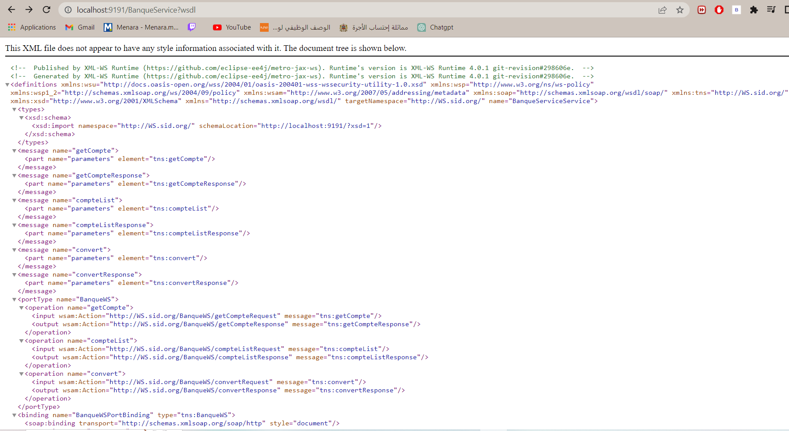

<H1  style="text-align:center"> Soap BANKING </H1> 
<H3>- Wsdl LIST </H3>

<H3>- Schema Xsd </H3>

<H2>- SoapUi (Test) </H2>
<H3>- convert Method </H3>

<H3>- accountList Method </H3>

<H3>- getAccount Method </H3>

<H2>- Client With Java </H2>

